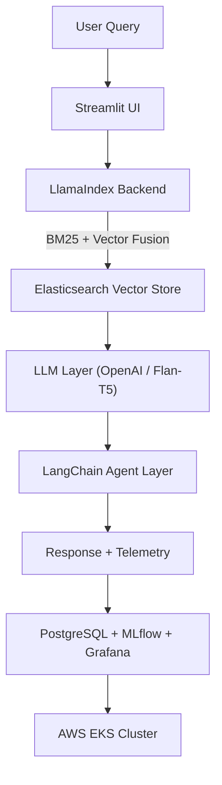

# Finance Document Assistant — LlamaIndex + RAG + Agents + MLOps + AWS EKS

An end-to-end **Retrieval-Augmented Generation (RAG)** and **Agentic Document Assistant** designed for financial text intelligence.  
This version is a **LlamaIndex-powered upgrade**, integrating **Elasticsearch hybrid retrieval**, **OpenAI embeddings**, and **LangChain-based multi-agent orchestration**, deployed via **Docker**, **GitHub Actions (CI/CD)**, and **AWS EKS (Kubernetes)**.

---

##  Key Upgrades (LlamaIndex Edition)

| Feature | Description |
|----------|--------------|
| **LlamaIndex Integration** | Replaces manual retriever logic with unified LlamaIndex pipelines (`VectorStoreIndex`, `RetrieverQueryEngine`) |
| **OpenAI Embeddings** | Uses `text-embedding-3-small` for dense retrieval via `llama_index.embeddings.openai` |
| **Elasticsearch Vector Store Adapter** | Seamlessly indexes dense vectors + BM25 documents through `llama_index.vector_stores.elasticsearch` |
| **Hybrid RRF Retriever** | Combines LlamaIndex BM25 + vector search with Reciprocal Rank Fusion (RRF) for improved recall |
| **Automatic Backend Configuration** | `.env`-driven initialization of embedding model, LLM provider, and Elasticsearch credentials |
| **Improved Query Engine** | Unified `LlamaIndexBackend` exposes `.query()` and `.build_query_engine()` for vector, BM25, or hybrid retrieval |
| **Local Offline Support** | Falls back to HuggingFace embeddings + Flan-T5 LLM when no API key is available |

---

##  Core Features (Retained + Enhanced)

| Category | Description |
|-----------|--------------|
| **Hybrid Search (RRF)** | BM25 + OpenAI or HuggingFace embeddings fused with RRF inside LlamaIndex |
| **Agents (LangChain)** | Finance-aware agents for contextual chat, summarization, and metric visualization |
| **Conversational QA** | Uses OpenAI LLMs (or local Flan-T5 fallback) for context-grounded answers |
| **Evaluation Metrics** | Automated Hit-Rate, MRR, and Latency tracking — logged to MLflow + PostgreSQL |
| **MLOps Integration** | MLflow + Grafana for experiment and latency monitoring |
| **Containerization** | Docker and CI/CD with GitHub Actions |
| **Cloud Deployment** | AWS EKS (Kubernetes) manifests with Secrets and Namespaces |
| **Telemetry + Feedback** | PostgreSQL tables for user queries, latency, and satisfaction metrics |

---

## Project Structure

```
Finance-Document-Assistant-RAG-Agents-LlamaIndex/
│
├── llm-app/
│ └── streamlit/
│ ├── app.py # Main Streamlit UI (Search + Chat)
│ └── src/
│ ├── agents/ # Agent layer (LangChain orchestration)
│ │ ├── agent_layer.py
│ │ └── summarizer_agent.py
│ ├── analytics/ # Evaluation + telemetry + metrics
│ │ ├── evaluation.py
│ │ ├── llm.py
│ │ └── plot_tools.py
│ ├── core/ # Core RAG + LlamaIndex backend
│ │ ├── llamaindex_backend.py # Unified backend (OpenAI + ES)
│ │ ├── search_backend.py # Bridges old bm25/hybrid API
│ │ ├── connection.py # DB + ES connectors
│ │ ├── elasticSearch.py # BM25 helpers
│ │ ├── index_vectors.py # Vector indexing via LlamaIndex
│ │ └── raw_index_vectors.py # Direct REST indexing (fallback)
│ ├── ground_truth/ # Evaluation dataset
│ └── utils/ # Preprocessing utilities
│
├── orchestration/k8s/ # Kubernetes manifests
│ ├── namespace.yaml
│ ├── secrets.yaml
│ ├── deployment.yaml
│ └── service.yaml
│
├── Dockerfile
├── docker-compose.yaml
├── requirements.txt
├── .env.example
├── scripts/run_evaluation.py
└── .github/workflows/build.yml # GitHub Actions CI/CD
```
---

---

## LlamaIndex Architecture Overview


---
**How LlamaIndex Works Here**

Initialization
LlamaIndexBackend() loads .env → configures embeddings, LLM, and node parser.

Vector Indexing
Runs via index_vectors.py or raw_index_vectors.py to embed documents and push to Elasticsearch.

Hybrid Retrieval
SimpleHybridRetriever combines vector + BM25 results using Reciprocal Rank Fusion (RRF).

Query Engine
build_query_engine() returns a RetrieverQueryEngine for structured RAG QA.

Streaming Integration
search_backend.py wraps these calls, maintaining compatibility with old function names (bm25, knn, hybrid).

Agents Layer
The FinanceAgent uses this backend for context retrieval, summarization, and charting.

Evaluation + Logging
Results and metrics flow into MLflow and PostgreSQL for visualization on Grafana.

---
**Environment Setup**
---
Create Environment
```
conda create -n LLM_env python=3.10
conda activate LLM_env
pip install -r requirements.txt
```
**Setup Environment Variables**
---
.env file example:
```
ES_HOST=https://your-elasticsearch-host:443
ES_API_KEY=your-api-key
ES_VECTOR_INDEX=finance_docs_vector
ES_BM25_INDEX=finance_docs_bm25
OPENAI_API_KEY=sk-your-key
LLM_PROVIDER=openai
EMBED_MODEL=text-embedding-3-small
AGENT_MODEL=google/flan-t5-small
CHUNK_SIZE=800
CHUNK_OVERLAP=120
```
**Run Locally with Streamlit**
```
cd llm-app/streamlit
streamlit run app.py
```

**Docker Deployment**

**Build & Run Locally**
```
docker build -t finance-assistant-llamaindex .
docker run -p 8501:8501 --env-file .env finance-assistant-llamaindex
```

**Docker Compose**
```
docker compose up --build
```
---
**AWS EKS Deployment**

Create Cluster
```
eksctl create cluster --name finance-assistant \
  --region us-east-1 --node-type t3.medium --nodes 1
```
Apply Manifests
```
kubectl create namespace finance-assistant
kubectl -n finance-assistant create secret generic app-secrets \
  --from-literal=ES_HOST="..." \
  --from-literal=ES_API_KEY="..." \
  --from-literal=OPENAI_API_KEY="..."

kubectl apply -f orchestration/k8s/
```
Access the Application
```
kubectl get svc -n finance-assistant
```
| Metric                   | Tool                               |
| ------------------------ | ---------------------------------- |
| Retrieval Hit Rate / MRR | MLflow                             |
| Query Latency            | PostgreSQL + Grafana               |
| User Feedback            | PostgreSQL (`feedback_data` table) |
| Resource Utilization     | AWS CloudWatch / Grafana           |


**Example Query**

Input:

What happened to the operating profit in Q3?

Output:

Operating profit increased by 18% compared to Q2 due to lower operating expenses.

Mode Used: Hybrid (RRF via LlamaIndex)
Confidence: 0.87
Latency: 1.4 s

## Cleanup Commands
```
kubectl delete namespace finance-assistant
aws eks delete-cluster --region us-east-1 --name finance-assistant
```
## Container Registry
```
ghcr.io/theepankumargandhi/finance-document-assistant-rag-agents-llamaindex:latest
```
